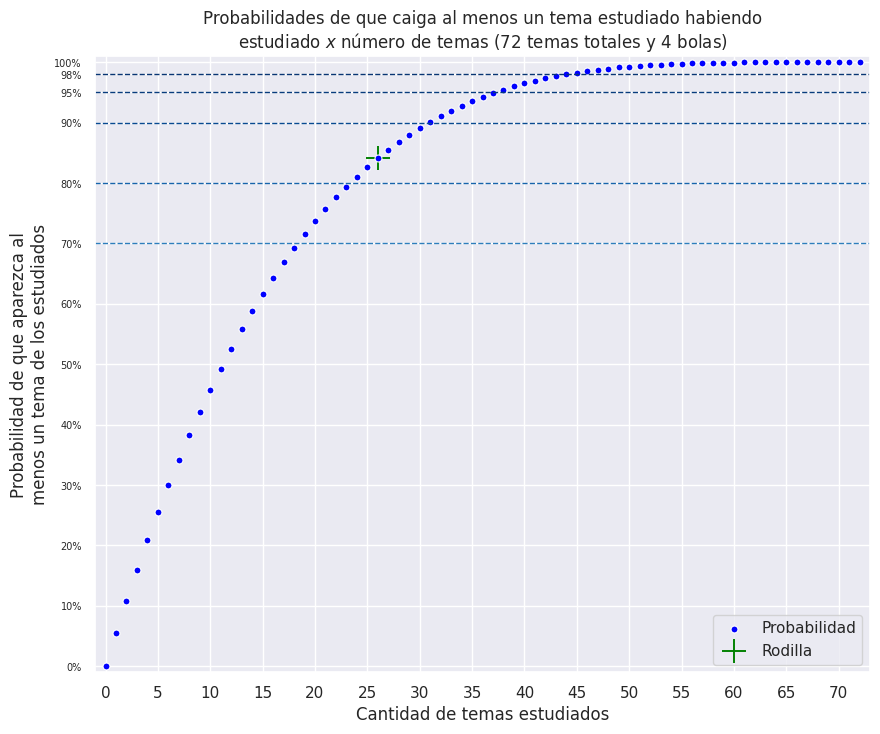

# Calculadora de probabilidades para oposiciones // exámenes donde los temas se extraigan por sorteo

![Seaborn](https://img.shields.io/badge/Seaborn-%2388afbb.svg?logo=data:image/svg+xml;base64,PHN2ZyB4bWxucz0iaHR0cDovL3d3dy53My5vcmcvMjAwMC9zdmciIHZpZXdCb3g9IjAgMCA1MDAgNTAwIj48cGF0aCBkPSJNNiAyMDhjNy00NCAyNi04MiA1NC0xMTZBMjQyIDI0MiAwIDAgMSAyNzggNWEyMzkgMjM5IDAgMCAxIDE2MSA4NSAyNDggMjQ4IDAgMCAxIDU5IDE0OCAyNDYgMjQ2IDAgMCAxLTU2IDE2OGMtMjMgMjctNTEgNDgtODMgNjRBMjUxIDI1MSAwIDAgMSAyNyAzNTcgMjQ0IDI0NCAwIDAgMSA2IDIwOG0xNyAxMDNhMjM2IDIzNiAwIDAgMCAzNzcgMTE4Yzc3LTYxIDEwNi0xNjggNzAtMjU5QTIyNyAyMjcgMCAwIDAgMjc2IDE4IDIzMiAyMzIgMCAwIDAgMjMgMzEwWiIgZmlsbD0iI2ZmZiIgb3BhY2l0eT0iMSIvPjxwYXRoIGQ9Ik0yMyAzMTBBMjMzIDIzMyAwIDAgMSAyNzYgMThjOTUgMTIgMTYwIDYzIDE5NCAxNTEgMzYgOTEgNyAxOTgtNzAgMjYwQTIzNiAyMzYgMCAwIDEgMjMgMzEwbTQwNi0xODloMWwtMS0yLTEwLTEzYy02MC02NS0xMzUtOTAtMjIzLTcwQzEzNSA1MCA5MCA4NyA1NyAxNDBjLTcgMTItMTIgMjUtMTcgMzhsMiAyIDM1LTRjMjYtNiA1My05IDc3LTE5IDM1LTEzIDY5LTMwIDEwMy00NiA0NC0yMSA4OS0yNiAxMzYtNmwzNiAxNk0zNiAyODBsLTUgNCAxMCA0MiA1Mi0yM2MzNi0xNSA3My0xNiAxMDktMiAyMCA4IDM5IDE2IDU3IDI2IDUyIDI3IDEwNiA0NyAxNjUgNTEgNSAwIDgtMSAxMS01IDE4LTI4IDMwLTU4IDM1LTkwLTE3LTYtMzQtMTAtNTAtMTctMzEtMTMtNjEtMjgtOTItNDMtNTEtMjUtMTAzLTI2LTE1NCAwbC00MiAyMWMtMzEgMTUtNjIgMjktOTYgMzZtMTQyIDI2Yy00OS0xMC05MSA4LTEzMyAzMCAzOSA3OSAxMDAgMTI2IDE4OCAxMzMgNzYgNiAxMzgtMjIgMTg4LTc4LTI1LTUtNDktOS03My0xNi0zNy05LTcwLTI4LTEwNC00NGwtNjYtMjVtLTM0LTgwIDM1LTE3YzQ0LTIxIDg5LTI0IDEzNS0zbDUzIDI1YzI5IDE0IDU4IDI3IDg5IDM1bDE2IDRjMy00MS00LTc5LTIxLTExNS01LTEwLTExLTE4LTIyLTIybC0zMC0xNGMtNDAtMTctODAtMjEtMTIxLTRsLTY2IDMwYy01MyAyOC0xMTAgNDQtMTcwIDQ3LTUgMC03IDItOCA3bC02IDM3djM0YzQyLTggNzktMjYgMTE2LTQ0WiIgZmlsbD0idHJhbnNwYXJlbnQiIG9wYWNpdHk9IjEiLz48cGF0aCBkPSJNMzYgMjgwYzM0LTcgNjUtMjEgOTYtMzZsNDItMjFjNTEtMjYgMTAzLTI1IDE1NCAwIDMxIDE1IDYxIDMwIDkyIDQzIDE2IDcgMzMgMTEgNTAgMTctNSAzMi0xNyA2Mi0zNSA5MC0zIDQtNiA1LTExIDUtNTktNC0xMTMtMjQtMTY1LTUxLTE4LTEwLTM3LTE4LTU3LTI2LTM2LTE0LTczLTEzLTEwOSAybC01MiAyMy0xMC00MiA1LTRaIiBmaWxsPSIjZmZmIiBvcGFjaXR5PSIxIi8+PHBhdGggZD0ibTE3OSAzMDYgNjUgMjVjMzQgMTYgNjcgMzUgMTA0IDQ0IDI0IDcgNDggMTEgNzMgMTYtNTAgNTYtMTEyIDg0LTE4OCA3OC04OC03LTE0OS01NC0xODgtMTMzIDQyLTIyIDg0LTQwIDEzNC0zMFptLTM2LTgwYy0zNiAxOC03MyAzNi0xMTUgNDR2LTM0bDYtMzdjMS01IDMtNyA4LTcgNjAtMyAxMTctMTkgMTcwLTQ3bDY2LTMwYzQxLTE3IDgxLTEzIDEyMSA0bDMwIDE0YzExIDQgMTcgMTIgMjIgMjIgMTcgMzYgMjQgNzQgMjEgMTE1bC0xNi00Yy0zMS04LTYwLTIxLTg5LTM1bC01My0yNWMtNDYtMjEtOTEtMTgtMTM1IDNsLTM2IDE3WiIgZmlsbD0iI2ZmZiIgb3BhY2l0eT0iMSIvPjxwYXRoIGQ9Im00MjkgMTIwLTM2LTE1Yy00Ny0yMC05Mi0xNS0xMzYgNi0zNCAxNi02OCAzMy0xMDMgNDYtMjQgMTAtNTEgMTMtNzcgMTlsLTM1IDQtMi0yYzUtMTMgMTAtMjYgMTctMzggMzMtNTMgNzgtOTAgMTM5LTEwNCA4OC0yMCAxNjMgNSAyMjMgNzBsMTAgMTRaIiBmaWxsPSIjZmZmIiBvcGFjaXR5PSIxIi8+PHBhdGggZD0ibTQyOSAxMjAgMSAxaC0xdi0xWiIgZmlsbD0iI0IzRDZERSIgb3BhY2l0eT0iMSIvPjwvc3ZnPg==&logoColor=white)
![Matplotlib](https://img.shields.io/badge/Matplotlib-%23285479.svg?logo=data:image/svg+xml;base64,PD94bWwgdmVyc2lvbj0iMS4wIiBlbmNvZGluZz0idXRmLTgiPz4KPHN2ZyB2aWV3Qm94PSIwIDAgNTAwIDUwMCIgeG1sbnM9Imh0dHA6Ly93d3cudzMub3JnLzIwMDAvc3ZnIj4KICA8ZGVmcy8+CiAgPHBhdGggZD0iTSAyNDUuMzExIDYuMjc4IEMgNTguMjggOS4yNTIgLTU1LjQwMSAyMTMuNzk3IDQwLjY4NCAzNzQuNDYzIEMgMTM2Ljc3NCA1MzUuMTMgMzcwLjU2MyA1MzEuNDE1IDQ2MS41MDcgMzY3Ljc3NiBDIDU1MC43OTMgMjA3LjEyNCA0MzYuNjQ0IDkuMTk3IDI1My4wMjQgNi4yNzggTCAyNDUuMzExIDYuMjc4IFogTSAyNDUuMzExIDYwLjMzNiBDIDk5Ljg1NSA2My4zMDggMTIuMTU4IDIyMi44MDIgODcuNDU5IDM0Ny40MjMgQyAxNjIuNzU5IDQ3Mi4wNDUgMzQ0LjU3OCA0NjguMzI3IDQxNC43MzcgMzQwLjczNSBDIDQ2My4zNTQgMjUyLjMxMiA0MzMuMDczIDE0OS42NSAzNjAuNjI3IDk2LjQ0MiBDIDMzMC45ODIgNzQuNjY4IDI5NC4yNzUgNjEuMTc4IDI1My4wMjQgNjAuMzM2IEwgMjQ1LjMxMSA2MC4zMzYgWiBNIDI0NS4zMTEgMTE0LjM5MyBDIDE0MS40MzMgMTE3LjM2NiA3OS43MjYgMjMxLjc5OCAxMzQuMjM2IDMyMC4zNjggQyAxODguNzQ0IDQwOC45NDEgMzE4LjU4OSA0MDUuMjI2IDM2Ny45NTkgMzEzLjY4IEMgNDE1LjcwOCAyMjUuMTMzIDM1My41MDMgMTE3LjI2NSAyNTMuMDI0IDExNC4zOTMgTCAyNDUuMzExIDExNC4zOTMgWiBNIDI0NS4zMTEgMTY4LjQ1MSBDIDE4My4wMzEgMTcxLjQyNCAxNDcuMzE5IDI0MC43NzYgMTgxLjAzIDI5My4yODUgQyAyMTQuNzQzIDM0NS43OTQgMjkyLjU5MyAzNDIuMDc5IDMyMS4xNjIgMjg2LjU5NiBDIDM0OC4xOCAyMzQuMTI2IDMxMS45MjQgMTcxLjI2MSAyNTMuMDI0IDE2OC40NTEgTCAyNDUuMzExIDE2OC40NTEgWiBNIDI0NS4zMTEgMjIyLjUwOCBDIDIyNC43NDEgMjI1LjQ4MSAyMTUuMDk4IDI0OS42MjkgMjI3Ljk1NCAyNjUuOTc4IEMgMjQwLjgwOSAyODIuMzI2IDI2Ni41MjQgMjc4LjYxMiAyNzQuMjM3IDI1OS4yOSBDIDI4MC43MjUgMjQzLjA0NSAyNzAuMzE5IDIyNS4wMDYgMjUzLjAyNCAyMjIuNTA4IEwgMjQ1LjMxMSAyMjIuNTA4IFogTSA0OTIuMTU5IDI0OS41MzcgTCA2LjE3NiAyNDkuNTM3IE0gNDIyLjczMiA3NS43OCBMIDc1LjYwMyA0MjMuMjkzIE0gNDIyLjczMiA0MjMuMjkzIEwgNzUuNjAzIDc1Ljc4IE0gMjQ5LjE2NyA2LjI3OCBMIDI0OS4xNjcgNDkyLjc5NSIgc3R5bGU9InBhaW50LW9yZGVyOiBzdHJva2UgbWFya2VyczsgZmlsbC1ydWxlOiBldmVub2RkOyBmaWxsOiByZ2IoMjU1LCAyNTUsIDI1NSk7IGZpbGwtb3BhY2l0eTogMDsgc3Ryb2tlLXdpZHRoOiAxMHB4OyBzdHJva2U6IHJnYigyNTUsIDI1NSwgMjU1KTsiLz4KICA8cGF0aCBkPSJNIDE5NS4xNjkgMzMuMzA3IEwgMTE4LjAzIDcxLjkyIEwgMzgwLjMwNSA0MjcuMTU0IEwgNDE4Ljg3NSAzODguNTQyIEwgMjQ5LjE2NyAyNDkuNTM3IEwgMTk1LjE2OSAzMy4zMDcgWiIgc3R5bGU9ImZpbGw6IHJnYigyNTUsIDI1NSwgMjU1KTsiLz4KICA8cGF0aCBkPSJNIDY3Ljg4OCAxOTUuNDggTCA2Ny44ODggMzAzLjU5NCBMIDI0OS4xNjcgMjQ5LjUzNyBMIDY3Ljg4OCAxOTUuNDggWiIgc3R5bGU9ImZpbGw6IHJnYigyNTUsIDI1NSwgMjU1KTsiLz4KICA8cGF0aCBkPSJNIDI0OS4xNjcgMjQ5LjUzNyBMIDI3Mi4zMDkgMzg0LjY4IEwgMjI2LjAyNSAzODQuNjggTCAyNDkuMTY3IDI0OS41MzcgWiIgc3R5bGU9ImZpbGw6IHJnYigyNTUsIDI1NSwgMjU1KTsiLz4KICA8cGF0aCBkPSJNIDI0OS4xNjcgMjQ5LjUzNyBMIDI5OS4zMDkgOTUuMDg2IEwgMzM0LjAyMSAxMTQuMzkzIEwgMjQ5LjE2NyAyNDkuNTM3IFoiIHN0eWxlPSJmaWxsOiByZ2IoMjU1LCAyNTUsIDI1NSk7Ii8+CiAgPHBhdGggZD0iTSAyNDkuMTY3IDI0OS41MzcgTCAzMDMuMTY1IDIyNi4zNjkgTCAzMDcuMDIyIDI0MS44MTQgTCAyNDkuMTY3IDI0OS41MzcgWiBNIDI0OS4xNjcgMjQ5LjUzNyBMIDE0OC44ODUgMjk5LjczMyBMIDE2MC40NTcgMzE1LjE3OCBMIDI0OS4xNjcgMjQ5LjUzNyBaIiBzdHlsZT0iZmlsbDogcmdiKDI1NSwgMjU1LCAyNTUpOyIvPgo8L3N2Zz4=&logoColor=white)

**Para utilizar la calculadora de probabilidades**: [Pinchar aquí](https://colab.research.google.com/github/Daalma7/ProbabilidadOposiciones/blob/main/CalculadoraProbabilidadesOposiciones.ipynb)

¡Hola! Este es un pequeño proyecto donde podrás calcular la probabilidad de que aparezca al menos 1 tema estudiado en un exámen donde haya un determinado número de temas y se extraigan un subconjunto de ellos para desarrollar.

Para que tú puedas calcular dicha probabilidad, dejo aquí la fórmula. Habiendo $N$ temas, extrayendo $n$ bolas y habiéndote estudiado $x$ temas, la probabilidad de que al menos salga uno es:

$$P[\text{Al menos uno}]= 1-\prod_{i=0}^{n-1} \frac{N-x-i}{N-i} $$

Como ejemplo, si hay 100 temas, estudias 20 y se extraen 4 bolas, la probabilidad sería:

$$P[\text{Al menos uno}]= 1-\prod_{i=0}^{4-1} \frac{100-20-i}{100-i}=1-\prod_{i=0}^{3} \frac{80-i}{100-i}=1-\left(\frac{80}{100}\times \frac{79}{99}\times \frac{78}{98}\times \frac{77}{97} \right)\approx 0.5967 \text{ (Un 59.67\\%) }$$  

Además, en el código también se calcula una cantidad "óptima" de temas a estudiar. Esta cantidad, también llamada "punto de rodilla" o "knee point" es la cantidad de temas a partir de la cual, si se estudia un tema más, se consigue un incremento en la probabilidad menor a la proporción que supone estudiar dicho tema.  

Por ejemplo, si tenemos $N=100$ temas, estudiar un tema supone estudiar un $1\\%$ del total de temas. La cantidad de temas óptima de temas a estudiar será aquella que al estudiar un tema más (estudiando un $1\\%$ más de temas) suponga un incremento en la probabilidad de que aparezca al menos un tema de los estudiados menor a un $1\\%$.

AVISO: Esta cantidad "óptima" de temas no es la "mejor". A más temas estudies, más probabilidades tendrás de no salir con el examen en blanco siempre ;)

Ejemplos de resultados:

     
     

Adicionalmente se calculan las tablas completas con todas estas probabilidades para que se puedan consultar todos los resultados calculados con un una mayor precisión.

**Créditos**: David Villar Martos ([Link a Github](https://github.com/Daalma7))
